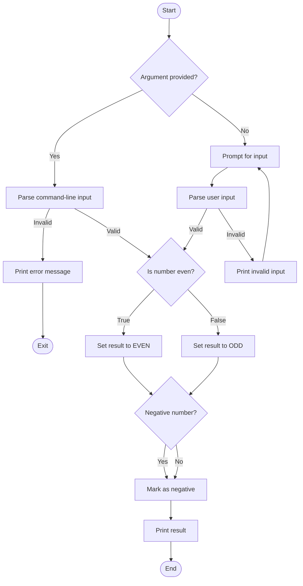

```mermaid
flowchart TD
    A([Start]) --> B{Argument provided?}
    B -- Yes --> C[Parse command-line input]
    C -- Valid --> D{Is number even?}
    C -- Invalid --> E[Print error message] --> F([Exit])

    B -- No --> G[Prompt for input]
    G --> H[Parse user input]
    H -- Valid --> D
    H -- Invalid --> I[Print invalid input] --> G

    D -- True --> J[Set result to EVEN]
    D -- False --> K[Set result to ODD]

    J --> L{Negative number?}
    K --> L
    L -- Yes --> M[Mark as negative]
    L -- No --> M

    M --> N[Print result]
    N --> O([End])
```
